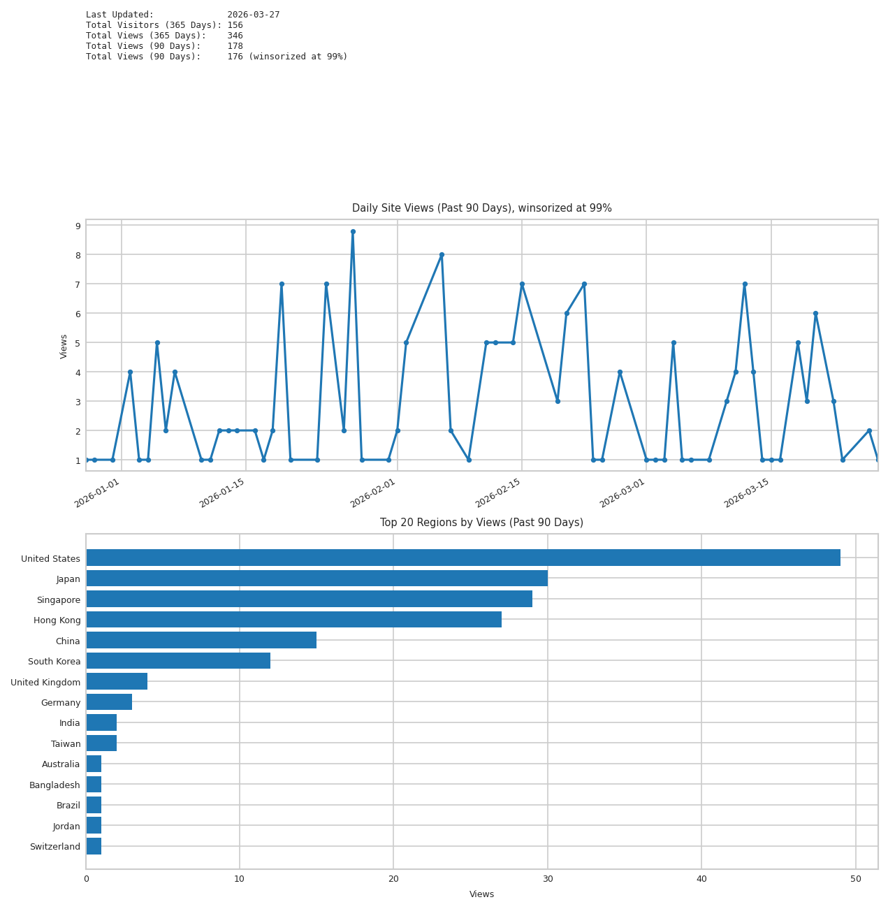

:::{.row .g-4 .align-items-center}

::: {.col-md-4 .text-center}
{.img-fluid .rounded-circle width=220}
:::

::: {.col-md-8}

<h1 class="profile-title">
  Dake Bu
  
    <a href="https://scholar.google.com/citations?hl=ja&user=mWrnNqsAAAAJ&view_op=list_works&sortby=pubdate" aria-label="Google Scholar" title="Google Scholar">
      G
    </a>
    <a href="https://github.com/DakeBU" aria-label="GitHub" title="GitHub">
      <svg viewBox="0 0 24 24" aria-hidden="true">
        <path d="M12 .5C5.7.5.8 5.4.8 11.7c0 4.9 3.2 9.1 7.7 10.6.6.1.8-.2.8-.5v-2c-3.1.7-3.8-1.3-3.8-1.3-.5-1.2-1.2-1.5-1.2-1.5-1-.7.1-.7.1-.7 1.1.1 1.7 1.2 1.7 1.2 1 1.7 2.6 1.2 3.2.9.1-.7.4-1.2.7-1.5-2.5-.3-5.1-1.2-5.1-5.5 0-1.2.4-2.2 1.1-3-.1-.3-.5-1.5.1-3 0 0 .9-.3 3.1 1.1.9-.2 1.8-.4 2.8-.4s1.9.1 2.8.4c2.1-1.4 3.1-1.1 3.1-1.1.6 1.5.2 2.7.1 3 .7.8 1.1 1.8 1.1 3 0 4.3-2.6 5.2-5.1 5.5.4.3.8 1 .8 2.1v3c0 .3.2.6.8.5 4.5-1.5 7.7-5.7 7.7-10.6C23.2 5.4 18.3.5 12 .5Z"/>
      </svg>
    </a>
    <a href="https://x.com/dakebu_cityu" aria-label="X" title="X">
      X
    </a>
  
</h1>
卜 大可 ・ ウラナイ タイカ

_, ._

Hi! I'm currently a PhD candidate at [Optima Group](https://optima.cs.cityu.edu.hk/), Department of Computer Science, City University of Hong Kong, advised by Prof. [Hau-San Wong](https://scholars.cityu.edu.hk/en/persons/cshswong/) and Prof. [Qingfu Zhang](https://www.cs.cityu.edu.hk/~qzhan7/index.html) since 2023 fall. I’m also fortunate to work closely with Prof. [Wei Huang](https://weihuang05.github.io) and Prof. [Andi Han](https://andihan3.github.io/). Before that, I completed my B.S in 2023 in Mathematics at Xi'an Jiaotong University, advised by Prof. [Hui Li](https://scholar.google.com/citations?hl=en&user=BhgtoWMAAAAJ) and mentored by Prof. [Jian Sun](https://scholar.google.com/citations?user=SSgNWOMAAAAJ&hl=En).

I'm currently an one-year intern at CFAR, A*STAR, where I'm supervised by Prof. [Atsushi Nitanda](https://sites.google.com/site/atsushinitanda/home). Prior to this, I spent one year (2024–2025) as a research intern at the University of Tokyo, working at the [Deep Learning Theory Team](https://www.riken.jp/en/research/labs/aip/generic_tech/deep_learn_theory/index.html) at RIKEN AIP under the supervision of Prof. [Taiji Suzuki](https://ibis.t.u-tokyo.ac.jp/suzuki/). From May to June, 2026, I visited the School of Mathematics and Statistics at the University of Sydney as a visiting student, supervised by Prof. [Andi Han](https://andihan3.github.io/). Earlier, from January to May 2023, I was a research assistant in the [LOGO](https://mypage.cuhk.edu.cn/academics/yutianshu/LOGO.html) Lab at The Chinese University of Hong Kong, advised by Prof. [Tianshu Yu](https://mypage.cuhk.edu.cn/academics/yutianshu/).

My research broadly covers theoretical foundations of deep learning, distribution optimization, mean-field optimization, sampling, reinforcement learning and their applications.

:::
:::

:::{.row .g-4}

::: {.col-lg-8}

## News

- 2026-06 - Our paper on [A Plug-in Doob h transform-induced Token-Ordering Module for Diffusion Language Models](https://arxiv.org/pdf/2604.24357) ([[code](https://github.com/DakeBU/DPRM-DLLM)]) is selected as **Oral** in **ICML 2026 Fogen**.
- 2026-06 - Two papers on [A Plug-in Doob h transform-induced Token-Ordering Module for Diffusion Language Models](https://arxiv.org/pdf/2604.24357) ([[code](https://github.com/DakeBU/DPRM-DLLM)]) and [theoretical explanation and solution to exploration dilemma in LLM post-training](https://openreview.net/forum?id=3dPpfbmZ3n) are accepted to **ICML 2026 Fogen**.  
- 2026-05 to 2026-06 - Visited the School of Mathematics and Statistics at the University of Sydney as a visiting student, supervised by Prof. [Andi Han](https://andihan3.github.io/).
- 2026-05 - Gave a talk titled "Langevin Dynamics with Partial Structure: From Guided Generative Sampling to Mean-Field Feature Learning" at the University of Sydney.
- 2026-05 - Presented [A Plug-in Doob h transform-induced Token-Ordering Module for Diffusion Language Models](https://arxiv.org/pdf/2604.24357) ([[code](https://github.com/DakeBU/DPRM-DLLM)]) at the AIVP-Joint workshop between A*STAR, RIKEN AIP, and NTU at Nanyang Technological University.
- 2026-05 - Honor to win the **Gold Reviewer Award** in ICML 2026.
- 2026-05 - One paper on [Provable benefit of transformer curriculum post-training](https://arxiv.org/pdf/2511.07372) accepted to **ICML 2026** ([[code](https://github.com/DakeBU/Curriculum-Post-training)]).  
- 2026-04 - Two papers on [Slowly Annealed Langevin Dynamics](https://arxiv.org/pdf/2605.07950) ([[code](https://github.com/anitan0925/sald/tree/main)]) and [A Plug-in Doob h transform-induced Token-Ordering Module for Diffusion Language Models](https://arxiv.org/pdf/2604.24357) ([[code](https://github.com/DakeBU/DPRM-DLLM)]) are available online.
- 2025-11 - One paper on [Provable benefit of transformer curriculum post-training](https://arxiv.org/pdf/2511.07372) is available on arXiv.
- 2025-01 — Two papers on [theoretical foundation of task vector in In-Context Learning](https://openreview.net/pdf?id=DbUmeNnNpt), and [Multi-objective Reinforcement Learning with Lexicographic Rewards](https://openreview.net/pdf?id=RTHTyTsRT3) are accepted to **ICML 2025**.  
- 2024-09 — One paper on [In context learning with multi-concept word semantics](https://proceedings.neurips.cc/paper_files/paper/2024/file/73efab19ebde03ff0958f4f155483f57-Paper-Conference.pdf) is accepted to **NeurIPS 2024**.  
- 2024-01 — One paper on [theoretical foundation of neural active learning](https://arxiv.org/pdf/2406.03944) accepted to **ICML 2025**.  

## Education

- Oct. 2023 – Present — PhD Candidate, Department of Computer Science, City University of Hong Kong (CityUHK).  
- Aug. 2019 – Jun. 2023 — School of Mathematics and Statistics, Xi’an Jiaotong University (XJTU).  

## Work Experience

- Dec. 2025 - Present, - Research Intern, CFAR A*STAR
- Dec. 2024 - Oct. 2023 - Research Intern, RIKEN AIP
- Jan. 2023- May. 2023 - Research Assistant, The Chinese University of Hong Kong, Shenzhen

## Service

- Area Chair: ICML 2026 FOGEN; ICLR 2026 DeLTa.
- Reviewer: ICML (2024; 2025; 2026); NeurIPS (2024; 2025; 2026); ICLR (2025; 2026).

:::

::: {.col-lg-4}

## Contact

- **Affiliation**:   
- **Location**:   
- **Email**: <>  

## Links

- 📄 [Curriculum Vitae](cv/cv.pdf)  
- 📚 [Google Scholar](https://scholar.google.com/citations?hl=ja&user=mWrnNqsAAAAJ&view_op=list_works&sortby=pubdate)  

---

## Site Statistics 📊

{width=60%}

:::

:::

  

  
  

